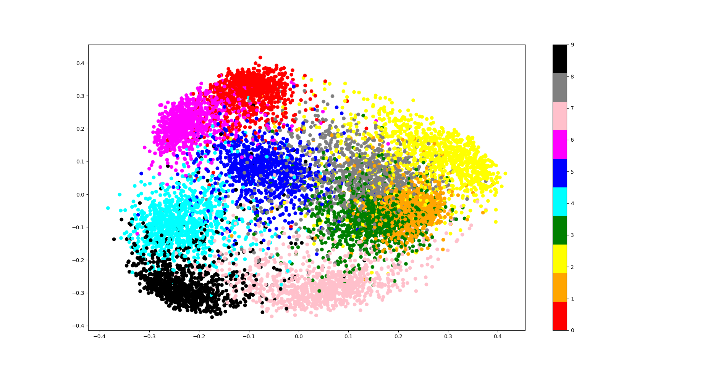

# Hyperbolic Neural Networks with `dm-haiku`

Hyperbolic embedding has proved to be powerful in numerous applications like graph embedding. The goal of this project is to make some of the current advances in Hyperbolic Neural Networks avaialable in JAX.

The neural networks are implemented with [Haiku](https://github.com/deepmind/dm-haiku) and the optimizers are based on [Optax](https://github.com/deepmind/optax).

## Installation 

Make sure to install jax by following the [official guide](https://github.com/google/jax#installation).

Install the project with pip:
```
pip install git+https://github.com/Raffaelbdl/hyperbolic-nn-haiku.git
```

## Content
The following content is currently implemented.

### Core
* `Manifolds`  
    * `Manifold` : interface to implement a Riemannian manifold.
    * `Stereographic` : implementation of the Stereographic manifold (generalization of the Poincaré manifold to handle positive curvature)
* `Activations` : wrapper and most popular activation functions for Riemannian manifolds.

### Layers
* `StereographicLinearLayer`: base linear layer in K-stereographic model
* `StereographicVanillaRNN`: base rnn layer in K-stereographic model
* `StereographicGRU`: gru cell in K-stereographic model

### Optimizers
* `rsgd`: base riemannian stochastic gradient descent
* `riemannian_adagrad`: riemannian version of the adagrad optimizer
* `riemannian_adam`: riemannian version of the adam optimizer
* `riemannian_adamw` : riemannian version of the adamw optimizer


## Observation of the Stereographic manifold

### Evolution of [-10, 10]² with the curvature


### Translation in stereographic space of curvature -1


### Scaling in stereographic space of curvature -1


### Second before last embedding after training on MNIST dataset
For fully euclidian architecture :


For fully hyperbolic architecture :


For hybrid architecture :


